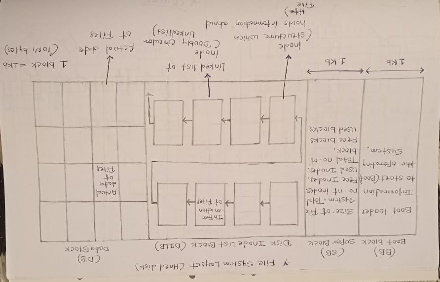
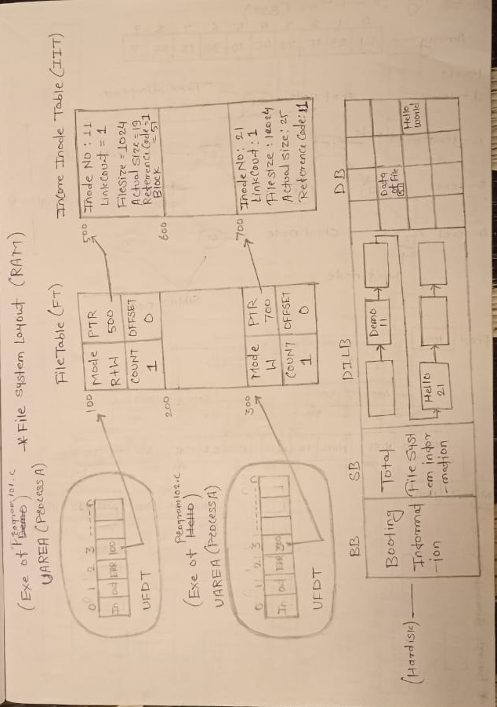
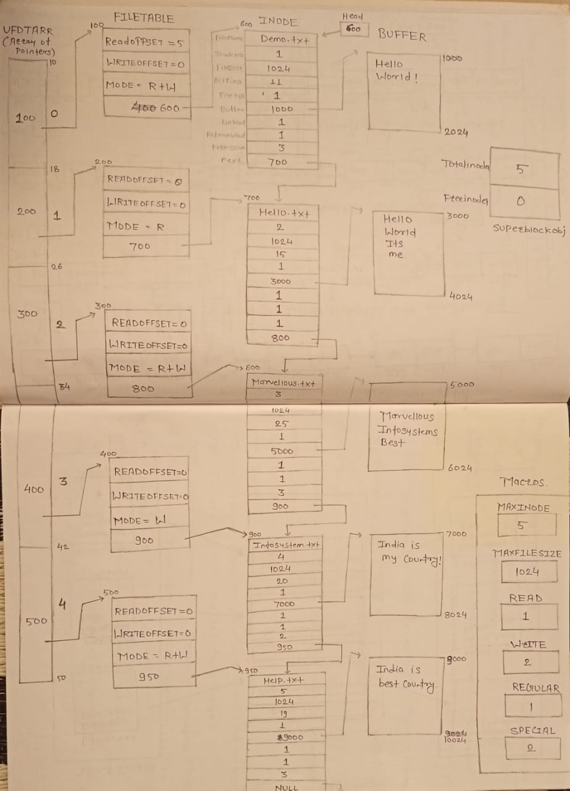

# Cusomised Virtual File System

**Technologies Used:** C++ Programming Language.

**Operating System Used:** As this project executes on a primary storage i.e RAM there is no special requirement of an operating system (we can use Linux,Windows,MacOS).

**Discription:** 
- This project is the virtual representation of file system.
- File system is considered as the way of storing the information about files & the data from the file into secondary storage device (hard disk).
- Every operating system has its own type of file system (NTFS, FAT32, FAT16, UFS). In this project, we implement the layout of a complete file system in RAM.
- In this project we implement almost every related system call used in file manipulation activity along with some important commands.
- This is research based project developed to understand internals of an operating system & explore the data structures implementation from c programming.

## FileSystem Layout (Hard disk)

#### The above diagram indicates the file system layout on the hard disk.
- The FileSystem is divided into four parts.
  
1. **Boot Block:** Its a block of 1kb size which contains the information used to start the operating system. When we press ON button of laptop or desktop the code from boot block gets executed.
2. **Super Block:** Its a block of 1kb size which contains the information about whole file system. This block contains the information about total no. of Inodes, used Inodes, free Inodes, total no. of blocks free blocks, used blocks etc.
3. **Disk Inode List Block (DILB):** It is a LinkedList of Inodes. Inode is considered as a structure which contains information about the file. For every file there is saperate Inode. Operating system will access the file by considering the content stored inside an Inode. 
  - Inode contains the following:
      1. Inode number
      2. Name of the file
      3. Size of the file (allocated memory)
      4. Actual size of the file (size of data)
      5. Permission of the file
      6. Last access and modification time
      7. Link count
      8. Block number allocated to the file
4. **Data Block:** This is one of the biggest section of file system. The data contains the actual data that we stored inside the file. Each block from data block is of 1kb size (1024 bytes). Inside the data block there is no information about the file.

  #### This concept of file system is applicable in any type of operating system. All the above information related to the hare disk only.

## Data Structures of file subsystem of RAM.

## 1 UAREA
  - It is called as **User AREA.**
  - For every running process saperate UAREA gets created.

## 2 UFDT
  - It is called the **User File Descriptor Table (UFDT).**
  - It is considered an array of pointers, where each pointer points to an entry in the file table.
  - In the UFDT, the first three entries are reserved: one for stdin (keyboard), one for stdout (monitor), and one for stderr (monitor).

## 3 File Table
  - This table contains information about opened files. 
  - This table contains offset from where we can read or write, it contains mode in which file is open. 
  - It contains the field name as count which is associated with new process creation, it contains the pointer which points to IIT.

## 4 IIT 
- It is called the **Incore Inode Table**.
- This table holds all the inodes whose files are opened by the running processes.
- The actual inodes are stored in the DILB, but when any process opens a file, the inode of that file gets loaded into the RAM and is stored inside the **Incore Inode Table**.
- The inode from IIT contains the information like Name of file, its Inode number, sizeof file, actual size, reference count, block number from data block etc.

# Structure of the CVFS

